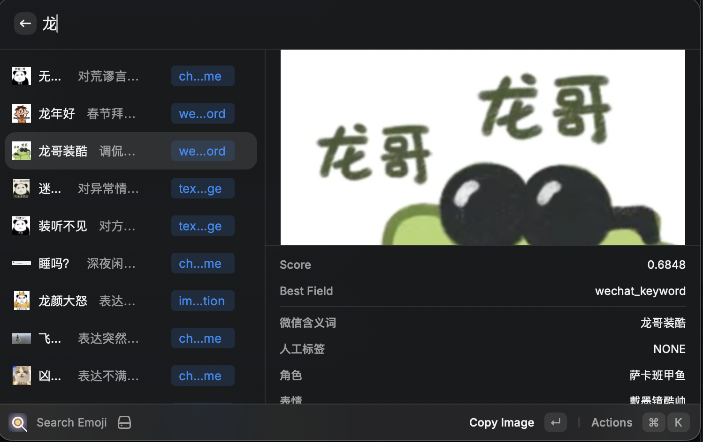
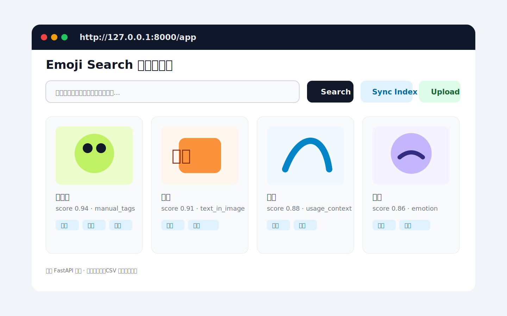
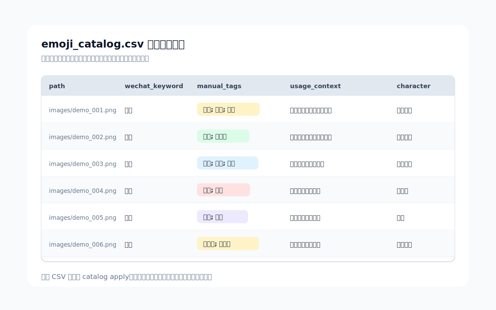
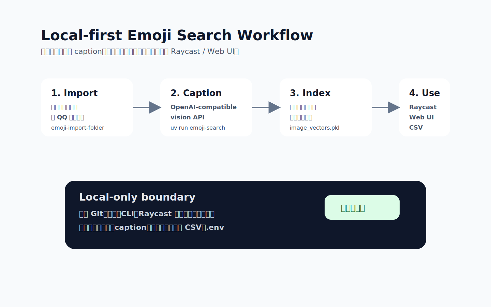

# Emoji Search

本项目是一个本地表情包语义检索工具：把图片整理到 `images/`，为每张图片生成结构化中文描述，再用向量模型做字段级语义搜索。

## 预览

主图是一次真实 Raycast 搜索截图，用来展示实际检索、预览和复制表情的效果；其余图是辅助说明的 mock 图。









## 当前状态

- 后端：`backend.py` 提供 FastAPI 接口，包含图片列表、上传/删除、caption、向量索引、搜索、模型加载/卸载。
- 前端：`static/` 是一个可用的本地管理页。
- Caption：`main.py` 可以调用 OpenAI-compatible vision API 批量生成 `image_index.jsonl`。
- Search：`semantic_search.py` 用 `sentence-transformers` 生成/查询 `image_vectors.pkl`。
- 数据接入：`emoji_search.image_folder` 可导入任意图片文件夹；`emoji_search.qq_pack` 保留给 QQ Chat Exporter 元数据场景。
- 交互式 CLI：`emoji-search` 负责配置 `.env`、导入图片、API caption、构建索引。
- 人工校对：`emoji_search.catalog` 可导出/回写 CSV，适合人工补特殊标签和微信含义词候选。

## 快速启动

```bash
uv sync
uv run uvicorn backend:app --reload
```

打开 <http://127.0.0.1:8000/app>。

常用环境变量可参考 `.env.example`。

## 推荐工作流：交互式 CLI

首次使用先同步依赖：

```bash
uv sync
```

然后启动交互式命令：

```bash
uv run emoji-search
```

菜单里按顺序完成：

1. 配置 API 到 `.env`：写入 API base URL、token、vision model。
2. 导入任意图片文件夹。
3. 调用 API caption 图片；CLI 会轮询并显示完成/失败/待处理数量。
4. 构建 `image_vectors.pkl`。

`.env` 中推荐使用项目专用变量：

```bash
EMOJI_API_BASE_URL=https://api.openai.com/v1
EMOJI_API_KEY=...
EMOJI_API_MODEL=gpt-4o-mini
```

CLI 会兼容原脚本使用的 `OPENAI_BASE_URL`、`OPENAI_API_KEY`、`OPENAI_MODEL`。底层请求仍然是原项目的 OpenAI-compatible `/chat/completions` image_url 请求。

## 导入任意图片文件夹

这是推荐的通用入口，不要求 `pack_info.json`。对方只要给一个图片目录，就可以复用同一套流程。

先检查目录：

```bash
uv run python -m emoji_search.image_folder inspect "/path/to/sticker-folder"
```

导入到项目 `images/`：

```bash
uv run python -m emoji_search.image_folder import "/path/to/sticker-folder" \
  --images-dir images \
  --mode copy \
  --prefix emoji \
  --collection "my-stickers"
```

同一台机器同一磁盘上可以把 `--mode copy` 换成 `--mode hardlink`，减少重复占用空间。导入器会按文件内容计算 `sha256`，默认跳过已导入过的重复图片。

## 导入 QQ 收藏表情

如果有 QQ Chat Exporter 的 `pack_info.json`，可以保留原始收藏顺序和 md5 信息：

```bash
uv run python -m emoji_search.qq_pack inspect \
  --pack-dir "/path/to/qq-chat-exporter/sticker-pack" \
  --source-dir "/path/to/qq/personal_emoji/Ori"
```

如果 `available_source_files` 大于 0，可以导入到本项目的 `images/`：

```bash
uv run python -m emoji_search.qq_pack import \
  --pack-dir "/path/to/qq-chat-exporter/sticker-pack" \
  --source-dir "/path/to/qq/personal_emoji/Ori" \
  --images-dir images \
  --mode hardlink
```

如果 exporter 的 `stickers/` 目录为空，可以用 `--source-dir` 指向 QQ 本地 `personal_emoji/Ori` 一类的原图目录；导入器会按 md5 和文件名匹配。

## API caption 和向量索引

如果不使用交互式 CLI，也可以直接调用原脚本。`main.py` 会读取 `.env`：

```bash
uv run python main.py \
  --images-dir images \
  --output image_index.jsonl \
  --workers 2
```

然后重建向量索引：

```bash
uv run python semantic_search.py build \
  --input image_index.jsonl \
  --output image_vectors.pkl
```

## 小模型预分类和聚类

在调用大视觉模型前，可以先跑本地 CLIP 小模型做一轮粗分流：它不调用 `.env` 里的 API，不识别你身边同学的名字，只输出机器可用的 `asset_type`、相似视觉簇和近重复组，方便后续只把代表图交给视觉 API caption。

```bash
uv run emoji-cluster run \
  --images-dir images \
  --encoder clip \
  --features image_cluster_features.pkl \
  --output image_clusters.csv
```

默认 CLIP 聚类阈值偏细，适合人工翻看角色/相似表情候选。想要更粗可以加 `--distance-threshold 0.22` 或 `0.28`，想要更细可以降到 `0.15`。

进一步用 `.env` 中配置的 Qwen 视觉模型处理每个视觉簇的代表图：

```bash
uv run emoji-qwen-representatives \
  --clusters image_clusters.csv \
  --output image_index.jsonl \
  --workers 2
```

这个命令只 caption 每个视觉簇的一张代表图，并把结果写回 `image_index.jsonl`。如果只想优先处理真人或卡通角色，可以加 `--asset-type real_person --asset-type cartoon_character`。如果要全量逐张 caption，再直接运行 `main.py`。

## 人工校对和特殊标签

导出一个人类可读的 CSV：

```bash
uv run python -m emoji_search.catalog export \
  --images-dir images \
  --caption-index image_index.jsonl \
  --clusters image_clusters.csv \
  --output emoji_catalog.csv
```

重点人工维护这几列：

- `manual_tags`：你的私有梗、人物外号、常用场景，多个标签可用 `;` 分隔。
- `wechat_keyword`：适合微信表情含义词的短词，尽量 4 个汉字以内。
- `usage_context`：聊天里什么时候用，例如“拒绝但不严肃”“装傻”“催更”。

回写到 `image_index.jsonl`：

```bash
uv run python -m emoji_search.catalog apply emoji_catalog.csv \
  --caption-index image_index.jsonl
```

回写后重新构建向量索引，人工标签就会参与语义搜索。

## Raycast / Alfred 接入建议

优先做 Raycast extension：它更适合这个项目的搜索结果列表、缩略图、快捷操作和复制文件到剪贴板。Alfred 也能通过 Script Filter 做，但更适合纯文本/路径型 workflow。

本仓库已经带了一个本地 Raycast extension：

```bash
cd raycast/emoji-search
npm install
npm run dev
```

首次运行后，Raycast 根搜索里会出现 `Emoji Search` 分组，包含：

- `Search Emoji`：输入自然语言，查看缩略图、语义字段、人工标签和分数。
- `Open Emoji Catalog`：打开 `emoji_catalog.csv`，用于人工补标签。
- `Sync Emoji Index`：调用本地后端同步缺失或过期向量。

使用 `Search Emoji` 时，回车默认复制图片文件到剪贴板，`Cmd+Shift+P` 才会粘贴到当前前台应用。这样可以先在 Raycast 里确认结果，再决定是否发到 QQ/微信。复制/粘贴会优先使用本地 `Project Root` 下的原图；如果 Raycast 没有拿到项目路径，会从本地 FastAPI 的 `/images/...` 预览地址下载到临时目录后再复制。`Open Emoji Catalog` 和 `Reveal in Finder` 需要在 Raycast 扩展偏好里填写 `Project Root`。

推荐插件目标：

- 输入自然语言查询。
- 显示表情缩略图、微信含义词、人工标签、使用场景。
- 回车复制图片文件到剪贴板。
- `Cmd+Shift+P` 粘贴到前台 QQ/微信。
- `Cmd+K` 或 action panel 打开原图、复制路径、复制标签。

## 微信表情准备

索引里已经预留 `wechat_keyword`，它对应微信表情开放平台里的“含义词”概念。真正上架或整理成微信表情候选时，还需要额外做一层导出：

- 选择 8/16/24 张同风格候选，或按“表情单品”逐个处理。
- 主图统一整理到微信要求尺寸，例如 240x240。
- 动态图保留 GIF，静态图按微信要求生成合适的 PNG/GIF 候选。
- 生成缩略图和含义词清单。

这个适合下一步单独做 `emoji_search.wechat_export`。

## 生成文件

这些文件不进 Git：

- `images/`
- `image_index.jsonl`
- `image_vectors.pkl`
- `image_manifest.jsonl`
- `image_cluster_features.pkl`
- `image_clusters.csv`
- `emoji_catalog.csv`
- `annotation_batches/`
